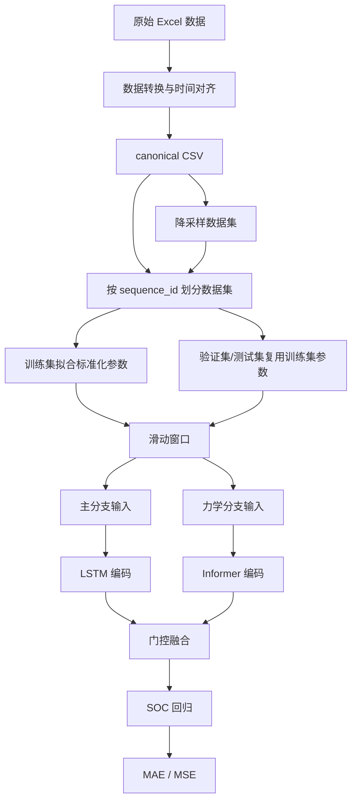

# 储能电池 SOC 估计论文路线图

## 0. 已确认投稿与写作边界

已确认信息如下：

| 项目 | 确认内容 |
|---|---|
| 目标期刊 | `Journal of Power Sources`, `Energy`, `Journal of Energy Storage` |
| 论文类型 | 完整研究论文 |
| 篇幅策略 | 先按约 `5000-7000` 词量级规划正文 |
| 模型名称 | DSMI-LI |
| 推荐题目 | 保留 |
| 当前写作语言 | 先写中文路线图，不加入英文主线表达 |

投稿前需要再次核对目标期刊的最新作者指南。当前路线图采用三本期刊都较稳妥的写法：正文证据链完整，图表数量控制在 `7` 张图和 `4` 张表，避免把有限实验过度包装成跨电池、严格跨倍率或具体电池化学体系结论。

## 1. 论文定位


推荐题目：

```text
面向储能电池 SOC 估计的力学感知双流 LSTM-Informer 门控融合方法
```

论文核心问题：

```text
在储能电池 SOC 估计中，如何利用充放电过程中的力学响应及其在线派生特征，增强模型对机械状态演化信息的表征，并通过原始电-热-力动态信号与力学演化特征的双流分离建模和门控融合，提高 SOC 估计精度。
```

建议贡献写成三点：

1. 整理包含多倍率、多初始预紧力或历史完整充放电序列的储能电池电-热-力联合数据集。
2. 基于项目在线计算的力学派生特征，将原始动态信号与力学演化特征分流建模。
3. 通过固定 `2000N_25degC_0.5C` 为独立测试工况，并结合基线对比、输入特征消融、结构消融和降采样实验，验证力学特征与双流门控融合结构对 SOC 估计的作用。

论文中不要把“加入力信号”或“使用 LSTM/Informer”本身写成唯一创新，重点应放在“力学特征构造、双流分离建模、门控融合、消融验证”这一条证据链上。多倍率或历史完整序列扩展是数据组织方式，`2000N_25degC_0.5C` 测试集是防止数据泄露和检验独立工况表现的验证设计，它们都不是论文核心问题本身。

## 2. 实验设计与数据集

### 2.1 实验对象与测试平台

实验对象与测试平台信息参考 `E:\paper\SOC\设备.docx`。

| 项目 | 参数或型号 | 论文中用途 |
|---|---|---|
| 电池类型 | 方壳储能电池 | 说明研究对象 |
| 额定容量 | `280 Ah` | 说明电池规格 |
| 实测容量 | `292.04 Ah` | 容量标定结果，可用于实验平台描述 |
| 充/放电截止电压 | `3.65 V / 2.5 V` | 说明充放电边界 |
| 工作温度范围 | `-20°C` 至 `45°C` | 说明电池规格 |
| 正极材料 | 磷酸铁锂 | 仅作为实验对象规格，不扩展为跨体系结论 |
| 负极材料 | 石墨 | 仅作为实验对象规格 |
| 循环寿命 | `>6000` 次 | 说明电池规格 |
| 充放电测试系统 | 新威 `CE-6004A-5V1200A-HF` | 采集电压、电流等电信号 |
| 高低温恒温箱 | 新威 `WGDW-1000L-70B` | 控制环境温度 |
| 压力传感器 | `CPR162-082-S02` | 采集力信号 |
| 压力传感器量程 | `10000 N` | 说明力信号测量范围 |
| 压力传感器综合精度 | `≤0.5% R.O.` | 说明测量精度 |
| 压力传感器蠕变 | 30 分钟内 `≤0.1%` | 说明力信号稳定性 |

实验前处理可在论文中简要写为：先以 `0.1C` 进行三次完整充放电激活，再在 `25°C` 下进行三次容量标定，取平均放电容量作为实测容量。

### 2.2 数据集范围与命名规则

正式主实验只使用这一块储能电池，但不再把训练/验证数据限制为固定 `0.5C` 倍率。后续可纳入多倍率、多预紧力或历史完整充放电序列；测试集固定为 `2000N_25degC_0.5C` 序列，用于形成独立测试工况。

| 因素 | 设置 |
|---|---|
| 温度 | 以每条完整序列的实际工况为准；当前测试序列为 `25°C` |
| 倍率 | 不固定为 `0.5C`；训练/验证可包含多倍率完整充放电序列 |
| 初始预紧力 | `2000N_25degC_0.5C` 序列作为测试集；其它完整序列用于训练/验证 |
| 电池数量 | 1 块储能电池 |
| 数据规模 | 以后续清点并成功转换的完整充放电序列数为准 |

建议文件命名统一为如下格式，文件名将作为项目中的 `sequence_id`：

```text
{temperature}C_{rate}C_{preload}N.xlsx
```

示例：

```text
10C_0.5C_2000N.xlsx
25C_0.1C_3000N.xlsx
25C_0.5C_0N.xlsx
40C_0.5C_2000N.xlsx
```

`0N` 建议表述为：

```text
0N 表示不施加额外初始预紧力，仅保持传感器与电池表面的必要接触。
```

说明：后续纳入多倍率或历史完整充放电序列前，需要逐条确认其温度、倍率、初始预紧力、是否为完整充放电、是否包含可对齐的力信号和温度信号。当前测试集只使用 `2000N_25degC_0.5C`，结果讨论中不能把误差变化单独归因于所有 `2000N` 预紧力工况。

## 3. 项目数据流程

论文方法与实验应尽量沿用项目现有流程：

```text
原始 Excel
-> prepare_data.py
-> canonical CSV
-> 写入 train/val/test 划分
-> 标准化
-> 滑动窗口
-> 模型训练
-> 测试与结果统计
```

对应项目位置：

| 内容 | 项目依据 |
|---|---|
| Excel 转换 | `scripts/prepare_data.py`, `src/data/converters/cycler_workbook.py` |
| 力学特征 | `src/data/converters/features.py` |
| 数据划分 | `src/data/dataset.py` |
| 标准化 | `src/data/preprocess.py` |
| 滑动窗口 | `src/data/window.py` |
| 双流模型 | `src/models/dual_stream.py` |
| 门控融合 | `src/models/fusion.py` |
| 降采样 | `scripts/downsample_data.py`, `src/data/downsample.py` |
| 指标输出 | `src/experiment.py`, `src/evaluation` |

必须遵守三条原则：

1. 数据划分按 `sequence_id` 进行，不能按窗口或采样点随机划分。
2. 标准化参数只在训练集拟合，验证集和测试集复用训练集参数。
3. 滑动窗口不能跨越不同 `sequence_id`。

## 4. 数据字段与标签

Excel 工作簿至少需要包含三张表：

| 工作表 | 必要列 | 项目用途 |
|---|---|---|
| `record` | `绝对时间`, `电流(A)`, `电压(V)`, `工步类型` | 获取电压、电流、时间和充放电状态 |
| `auxAdapter` | `绝对时间`, `PV1` | 获取力信号 |
| `auxTemp` | `绝对时间`, `T3` | 获取温度信号 |

转换后的 canonical CSV 标准字段如下：

| 字段 | 项目来源或计算方式 | 论文解释 |
|---|---|---|
| `time` | 相对首个有效采样点的秒数 | 采样时间 |
| `voltage` | `record["电压(V)"]` | 端电压 |
| `current` | `record["电流(A)"]`，充电为正、放电为负 | 电流 |
| `power` | `voltage * current` | 瞬时功率 |
| `cc_capacity` | 电流积分得到的容量变化量 | 在线容量变化 |
| `force` | `auxAdapter["PV1"]` 对齐到主时间轴 | 力信号 |
| `temperature` | `auxTemp["T3"]` 对齐到主时间轴 | 温度 |
| `delta_f` | `force(t) - force(0)` | 累计力变化量 |
| `delta_q` | `cc_capacity(t) - cc_capacity(0)` | 累计容量变化量 |
| `df_dt` | 相邻采样点力变化量 / 时间变化量 | 力对时间的局部变化率 |
| `df_dq` | 相邻采样点力变化量 / 容量变化量 | 力对容量的局部变化率 |
| `force_slope` | 累计力变化量 / 累计容量变化量 | 累计力-容量斜率 |
| `soc` | 由完整充放电容量归一化得到 | 模型标签 |
| `sequence_id` | Excel 文件名 stem | 完整序列标识 |

模型输入分为两组：

```text
主分支输入：voltage, current, temperature, force
力学分支输入：delta_f, delta_q, df_dt, df_dq, force_slope
输出标签：soc
```

SOC 标签由项目在转换阶段构造：

```text
充电阶段：当前累计充电容量 / 本序列总充电容量
放电阶段：1 - 当前累计放电容量 / 本序列总放电容量
```

最终 `soc` 限制在 `[0, 1]`。论文中不另设新的 SOC 标签名称。

## 5. 整体框架



## 6. 模型方法

本文主模型采用项目中的 `dual_stream` 架构。

| 模块 | 设置 | 作用 |
|---|---|---|
| 主分支 | LSTM | 建模电压、电流、温度、力信号的短时动态响应 |
| 力学分支 | Informer | 建模力学派生特征的时序演化 |
| 融合模块 | gated fusion | 自适应融合两类深度表征 |
| 输出层 | 回归头 | 输出当前窗口末端的 SOC |

门控融合以项目实现为准：

```text
g = sigmoid(Wg [z_main, z_mech] + bg)
z_fused = g * z_main + (1 - g) * z_mech
soc_hat = Head(z_fused)
```

写作时需要注意：

- `g` 是向量门控，不是单个标量。
- gated 融合要求两个分支输出维度一致。
- `last_gate` 可以辅助解释分支权重，但不能写成严格因果贡献。

## 7. 数据集划分

本文采用一组防数据泄露的独立工况划分：将 `sequence_id` 匹配 `2000N_25degC_0.5C` 的完整序列作为测试集，其余完整充放电序列划分为训练集和验证集。

| sequence_id 规则 | 划分 |
|---|---|
| `2000N_25degC_0.5C` | 测试集 |
| 其它完整充放电序列 | 训练集 / 验证集 |

该划分的论文含义是：模型训练时不使用 `2000N_25degC_0.5C` 序列，测试集固定为该独立完整序列，以避免窗口级随机划分造成的数据泄露，并检验模型在指定测试工况下的估计表现。其它完整序列可按固定比例或人工指定方式划分为训练集和验证集，但划分必须在 `sequence_id` 级别完成。

不要把该结果写成跨电池泛化、严格跨倍率泛化或所有 `2000N` 工况泛化。应明确写为独立 `2000N_25degC_0.5C` 测试工况，而不是单独归因于预紧力变化。

## 8. 实验设置

### 8.1 采样与窗口设置

采样与窗口参数参考项目 `E:\Project\myproject`：

| 参数 | 项目设置 | 论文写法 |
|---|---|---|
| 原始 canonical 数据采样间隔 | `1s` | Excel 转换阶段执行 `1 Hz` 去重采样 |
| 降采样间隔 | `5s`, `10s`, `30s` | 由 `downsample_data.py` 生成低频数据集 |
| 滑动窗口长度 | `20` 个时间步 | 每个输入样本包含连续 `20` 个采样点 |
| 滑动步长 | `1` 个时间步 | 相邻窗口滑动一个采样点 |
| 标签位置 | 窗口最后一个时间步 | 预测当前窗口末端 SOC |
| 窗口边界 | 不跨 `sequence_id` | 避免不同实验序列混合 |

需要在论文中说明：项目默认窗口长度是固定时间步数，而不是固定物理时长。因此在采样间隔为 `1s`, `5s`, `10s`, `30s` 时，`20` 个时间步分别覆盖约 `20s`, `100s`, `200s`, `600s` 的历史信息。

降采样由项目按 `time` 网格抽取样本点，并在降采样后重新计算 `power` 和力学派生特征，尤其是 `df_dt`、`df_dq` 和 `force_slope`。

### 8.2 训练超参数

训练超参数以项目默认配置和 DSMI-LI 实验配置为准：

| 类别 | 参数 | 设置 |
|---|---|---|
| 随机性 | `seed` | `42` |
| 数据加载 | `batch_size` | `64` |
| 数据加载 | `num_workers` | `0` |
| 训练轮数 | `epochs` | 最大 `50` 轮 |
| 优化器 | `optimizer` | Adam |
| 学习率 | `learning_rate` | `0.001` |
| 权重衰减 | `weight_decay` | `0.0` |
| 损失函数 | `loss` | MSE |
| 早停 | `patience` | `10` 轮 |
| 早停 | `min_delta` | `0.0` |
| 设备 | `device` | `auto` |

DSMI-LI 主模型结构参数：

| 模块 | 参数 | 设置 |
|---|---|---|
| 主分支 LSTM | `hidden_size` | `64` |
| 主分支 LSTM | `num_layers` | `2` |
| 主分支 LSTM | `dropout` | `0.0` |
| 主分支池化 | `pooling` | `last` |
| 力学分支 Informer | `hidden_size` | `64` |
| 力学分支 Informer | `num_layers` | `2` |
| 力学分支 Informer | `n_heads` | `4` |
| 力学分支 Informer | `d_ff` | `128` |
| 力学分支 Informer | `factor` | `5` |
| 力学分支 Informer | `attention` | `prob` |
| 力学分支 Informer | `distil` | `false` |
| 力学分支 Informer | `activation` | `gelu` |
| 力学分支 Informer | `dropout` | `0.1` |
| 力学分支池化 | `pooling` | `last` |
| 融合模块 | `fusion` | `gated` |
| 回归头 | `hidden_size` | `null`，即线性输出 |
| 回归头 | `dropout` | `0.0` |

正式实验配置建议使用项目论文配置中的规则划分方式：`data.raw_path: data/raw/*.xlsx`，`data.dataset_name: data`，并通过 `data.split_rules.test: ["2000N_25degC_0.5C"]` 固定测试集；其它未匹配序列按 `data.split_rules.remaining` 划分为训练集和验证集。若后续手工写入 `split` 列，则需保证每个 `sequence_id` 只属于一个划分。

### 8.3 评价指标

论文正文只报告 `MAE` 和 `MSE`：

```text
MAE = mean(|SOC_pred - SOC_true|)
MSE = mean((SOC_pred - SOC_true)^2)
```

论文表格也统一使用 `MAE` 和 `MSE` 两列。

### 8.4 基线模型

| 编号 | 模型 | 输入 | 目的 |
|---|---|---|---|
| M1 | LSTM | `U,I,T,F` | 常规时序基线 |
| M2 | Informer | `U,I,T,F` | 长序列建模基线 |
| M3 | DSMI-LI | `X_main + X_mech` | 本文主模型 |

### 8.5 输入特征消融

| 编号 | 输入 | 目的 |
|---|---|---|
| A1 | `U,I,T` | 电-热输入基线 |
| A2 | `U,I,T,F` | 验证原始力信号贡献 |
| A3 | `U,I,T,df_dq` | 验证关键力学导数贡献 |
| A4 | `U,I,T,F,df_dq` | 验证原始力与关键导数的组合 |
| A5 | `U,I,T,F,X_mech` | 验证完整力学特征贡献 |

### 8.6 结构消融

| 编号 | 结构 | 目的 |
|---|---|---|
| B1 | `LSTM_main` | 仅使用主分支特征 |
| B2 | `LSTM_all` | 所有特征简单拼接输入 LSTM |
| B3 | `Informer_all` | 所有特征简单拼接输入 Informer |
| B4 | `Dual-stream concat` | 双流编码后直接拼接 |
| B5 | `DSMI-LI` | 双流编码 + 门控融合 |

### 8.7 降采样实验

只保留采样间隔变化实验：

| 编号 | 采样间隔 | 生成方式 |
|---|---|---|
| C1 | `1s` | 原始或重采样 canonical CSV |
| C2 | `5s` | `downsample_data.py` |
| C3 | `10s` | `downsample_data.py` |
| C4 | `30s` | `downsample_data.py` |

训练、验证和测试的 `sequence_id` 规则保持不变，只比较不同采样间隔下的 `MAE` 和 `MSE`。如果每个采样间隔都重新训练并测试，论文中应写“低频采样适用性”；只有用 `1s` 训练、其他采样间隔测试时，才写“采样间隔变化下的鲁棒性”。

## 9. 正文图表规划

表内符号约定：

| 符号 | 含义 |
|---|---|
| `U` | 电压 |
| `I` | 电流 |
| `T` | 温度 |
| `F` | 力信号 |
| `X_main` | `U,I,T,F` |
| `X_mech` | `delta_f, delta_q, df_dt, df_dq, force_slope` |

### 9.1 正文图

| 编号 | 图名 | 放置位置 | 目的 |
|---|---|---|---|
| 图 1 | 实验平台与力传感器夹具示意图 | 数据集部分 | 说明力信号采集方式 |
| 图 2 | 不同工况下的电压、力信号与 SOC 曲线 | 数据分析部分 | 展示电-热-力数据差异 |
| 图 3 | 力学派生特征随 SOC 的变化 | 数据分析部分 | 支撑力学特征有效性 |
| 图 4 | DSMI-LI 模型结构图 | 方法部分 | 展示双流编码与门控融合 |
| 图 5 | 测试集 SOC 预测曲线 | 实验结果部分 | 展示最终估计效果 |
| 图 6 | 消融实验误差对比图 | 实验结果部分 | 展示输入和结构贡献 |
| 图 7 | 不同采样间隔误差对比图 | 实验结果部分 | 展示低频采样适用性 |

图 5 建议展示 `2000N_25degC_0.5C` 测试序列的 SOC 预测曲线。若后续扩展多个测试序列，正文可保留代表性多子图，完整测试序列曲线可放入补充材料或附录。

### 9.2 正文表

正式论文只保留 4 张结果表，建议按三线表排版，不使用竖线。

**表 1 基线模型对比结果**

| 模型 | 输入 | 编码与融合 | MAE | MSE |
|---|---|---|---:|---:|
| LSTM | `U,I,T,F` | LSTM |  |  |
| Informer | `U,I,T,F` | Informer |  |  |
| DSMI-LI | `X_main + X_mech` | LSTM + Informer + gated |  |  |

表注建议：测试集为独立 `2000N_25degC_0.5C` 数据；训练/验证集包含其它完整充放电序列，填入结果后将最优结果加粗。

**表 2 输入特征消融结果**

| 编号 | 输入 | 特征组 | MAE | MSE |
|---|---|---|---:|---:|
| A1 | `U,I,T` | 电-热基线 |  |  |
| A2 | `U,I,T,F` | 加入原始力信号 |  |  |
| A3 | `U,I,T,df_dq` | 加入关键力学导数 |  |  |
| A4 | `U,I,T,F,df_dq` | 原始力 + 关键导数 |  |  |
| A5 | `U,I,T,F,X_mech` | 完整特征 |  |  |

表注建议：所有输入组合使用相同数据划分、训练策略和评价指标。

**表 3 结构消融结果**

| 编号 | 结构 | 主分支 | 力学分支 | 融合 | MAE | MSE |
|---|---|---|---|---|---:|---:|
| B1 | `LSTM_main` | LSTM | - | - |  |  |
| B2 | `LSTM_all` | LSTM | - | - |  |  |
| B3 | `Informer_all` | Informer | - | - |  |  |
| B4 | `Dual-stream concat` | LSTM | Informer | concat |  |  |
| B5 | `DSMI-LI` | LSTM | Informer | gated |  |  |

表注建议：gated 融合中两个分支输出维度保持一致。

**表 4 采样间隔适用性结果**

| 采样间隔 | 数据生成方式 | 窗口长度 | MAE | MSE |
|---|---|---:|---:|---:|
| `1s` | 原始 canonical CSV | `20` |  |  |
| `5s` | 降采样 canonical CSV | `20` |  |  |
| `10s` | 降采样 canonical CSV | `20` |  |  |
| `30s` | 降采样 canonical CSV | `20` |  |  |

表注建议：窗口长度单位为时间步；降采样后需要重新计算力学导数特征；训练、验证和测试序列划分规则保持一致。

## 10. 论文正文写作顺序

### 10.1 引言

引言建议按以下逻辑写：

1. 储能电池 SOC 估计对安全运行和能量管理的重要性。
2. 仅依赖电压、电流和温度时，模型在复杂工况下可能缺少额外状态信息。
3. 力信号能够反映电池在充放电过程中的机械响应，但直接使用原始力信号不足以表达其演化规律。
4. 因此，本文构造在线力学派生特征，并设计双流模型分离原始动态信号与力学演化特征。

### 10.2 方法

方法部分建议分为四段：

1. 数据预处理与 SOC 标签构造。
2. 力学派生特征定义。
3. 双流 LSTM-Informer 模型。
4. 门控融合与 SOC 回归。

该部分要紧贴项目实现，不额外发明项目中没有的特征或模块。

### 10.3 实验

实验部分建议分为五段：

1. 实验平台和数据采集。
2. 数据集划分。
3. 训练设置。
4. 对比模型与消融实验。
5. 评价指标。

数据集划分需要说明：测试集固定为 `2000N_25degC_0.5C`，这是为了形成独立测试工况并避免数据泄露；写作时不要把这一点替代为全文核心问题。

### 10.4 结果与讨论

结果部分建议按证据强度排序：

1. 先报告基线模型对比，证明主模型整体有效。
2. 再报告输入特征消融，证明力信号和力学派生特征有效。
3. 再报告结构消融，证明双流和门控融合必要。
4. 最后报告采样间隔实验，说明低频采样条件下的适用性。

讨论部分要收束在本文实验边界内，不扩展到跨电池、严格跨倍率或具体电池化学体系。

### 10.5 结论

结论建议只写三点：

1. 本文整理了包含多倍率、多初始预紧力或历史完整充放电序列的储能电池电-热-力联合 SOC 估计实验数据，并以 `2000N_25degC_0.5C` 作为独立测试工况。
2. 双流 LSTM-Informer 门控融合模型能够利用原始动态信号与力学派生特征提升 SOC 估计性能。
3. 基线对比、消融实验和降采样实验共同说明，力学特征与双流门控融合结构具有进一步扩展到更多电池和更多工况的研究价值。

## 11. 写作边界

论文中应避免以下表述：

- 不写成跨电池泛化，因为当前只有一块储能电池。
- 不写成严格跨倍率泛化；多倍率数据用于扩展训练/验证分布，只有在专门按倍率留出测试时，才能讨论跨倍率泛化。
- 不写成未见温度泛化；若训练集未覆盖测试温度，只能作为独立 `2000N_25degC_0.5C` 测试工况中的温度分布差异进行讨论。
- 可在实验对象规格中写明正极材料为磷酸铁锂，但不要把结果扩展为跨化学体系结论。
- 不把门控权重解释为严格物理因果贡献。
- 不把 `df_dq` 和 `force_slope` 写成由真实 SOC 反推得到；它们来自 `force`、`cc_capacity` 和 `time`。

更稳妥的总结表述：

```text
本文基于同一储能电池的多倍率、多初始预紧力或历史完整充放电序列，构建在线力学派生特征，并采用双流 LSTM-Informer 与门控融合结构，将原始电-热-力动态响应和力学演化特征分离建模。实验固定 `2000N_25degC_0.5C` 序列作为独立测试集，并通过基线对比、输入特征消融、结构消融和降采样分析，验证力学特征与双流门控融合结构对 SOC 估计的作用。
```

## 12. 当前执行清单

| 优先级 | 任务 | 目的 |
|---|---|---|
| 1 | 将原始 Excel 文件名统一为 `{temperature}C_{rate}C_{preload}N.xlsx` | 保证 `sequence_id` 可解释 |
| 2 | 清点所有可用完整充放电序列，并确认三张工作表和必要列完整 | 保证项目可转换 |
| 3 | 将全部可用完整序列转换为 canonical CSV | 获得统一字段和 SOC 标签 |
| 4 | 使用 `2000N_25degC_0.5C` 固定测试集，其它序列划分训练/验证 | 固定防泄露数据划分 |
| 5 | 跑通 DSMI-LI 主模型 | 获得主结果 |
| 6 | 跑基线、输入消融和结构消融 | 支撑表 1 至表 3 |
| 7 | 生成 5s、10s、30s 降采样数据并实验 | 支撑表 4 |
| 8 | 整理预测曲线、误差图和消融柱状图 | 支撑正文图 |
| 9 | 根据结果撰写方法、实验、结果与讨论 | 形成论文初稿 |

项目层面后续注意：

- 若使用 `split_column: split`，需要在 canonical CSV 中补充 `split` 列；若不写入 `split` 列，则使用项目 `split_rules` 固定 `2000N_25degC_0.5C` 为测试集。
- 若要画门控权重图，需要在评估阶段批量收集 `last_gate`。
- 项目可以继续输出其他指标，但论文正文只展示 `MAE` 和 `MSE`。
